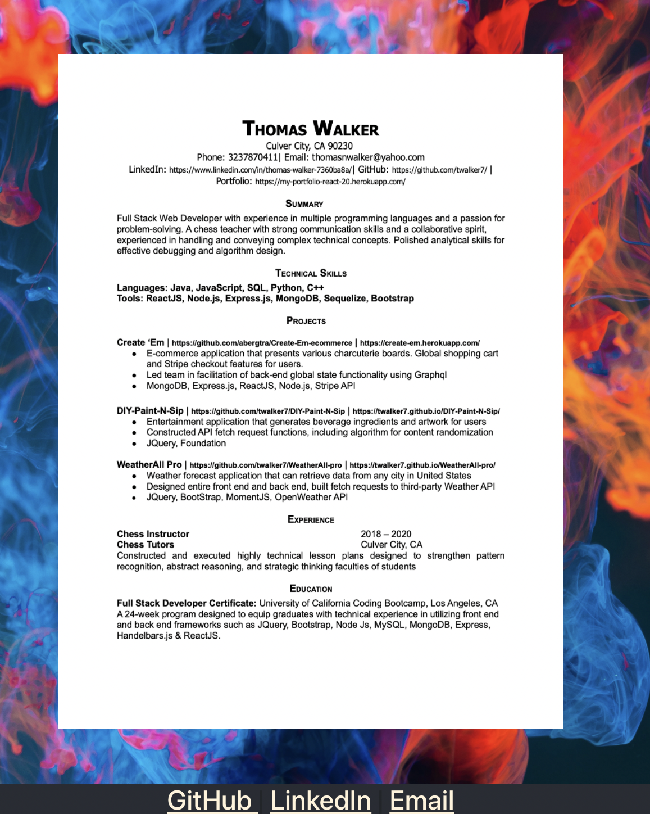

# My Portfolio built with React

## Description 

A single-page application portfolio built with React.js, containing the following sections: About Me, Projects, Resume, and Contact. 

## Table of Contents

* [Installation](#installation)
* [Usage](#usage)
* [Credits](#credits)
* [License](#license)
* [Contributing](#Contributing)
* [Contact](#Contact)
* [Presentation](#Presentation)

## Installation
Execute 'npm install' in command line  to install all dependencies 
 ### Technologies Used:
React.js
Node.js

## Usage 
Use the navigation bar to access the different page components of the porfolio

## Credits

Thomas Walker 

## License

## Contributing

    

## Tests
React's testing libraries: 
"@testing-library/jest-dom 5.14.1" /
"@testing-library/react"

## Contact

 github.com/twalker7

 ## Application Page link: 

 https://my-portfolio-react-20.herokuapp.com/
