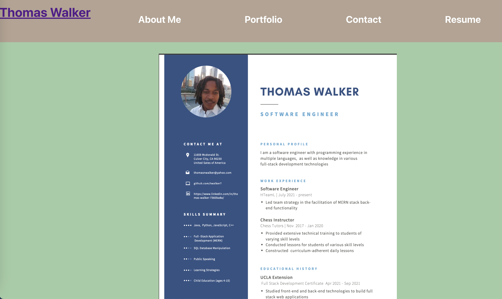

# My Portfolio built with React

## Description 

This is responsive portfolio application built with React.js

## Table of Contents

* [Installation](#installation)
* [Usage](#usage)
* [Credits](#credits)
* [License](#license)
* [Contributing](#Contributing)
* [Contact](#Contact)
* [Presentation](#Presentation)

## Installation
npm install  to install all dependencies 
 ### Technologies Used:
React.js
Node.js

## Usage 

Launch this application at localhost:3000 by running 'npm start'

## Credits

Thomas Walker 

## License

## Contributing

    

## Tests
React's testing libraries: 
"@testing-library/jest-dom 5.14.1" /
"@testing-library/react"

## Contact

 github.com/twalker7

 ## Application Page link: 

 https://my-portfolio-react-20.herokuapp.com/
